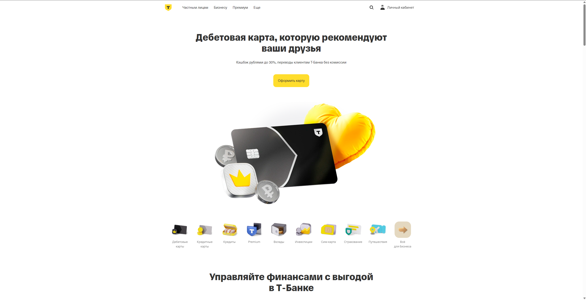
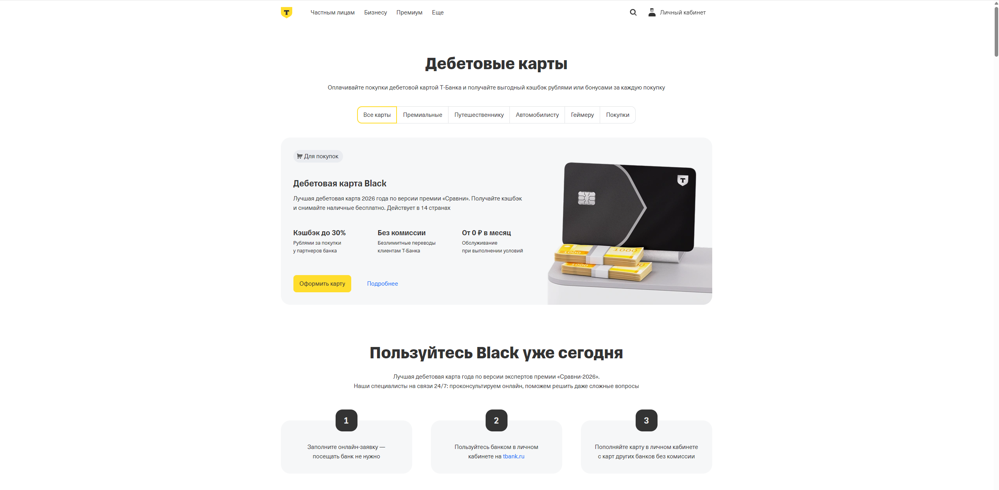
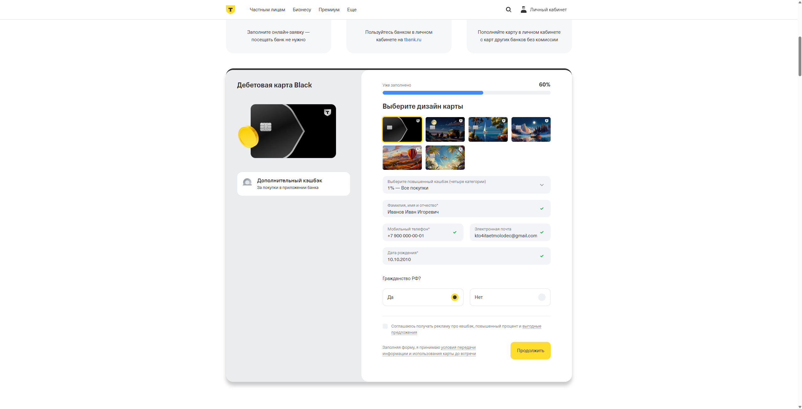
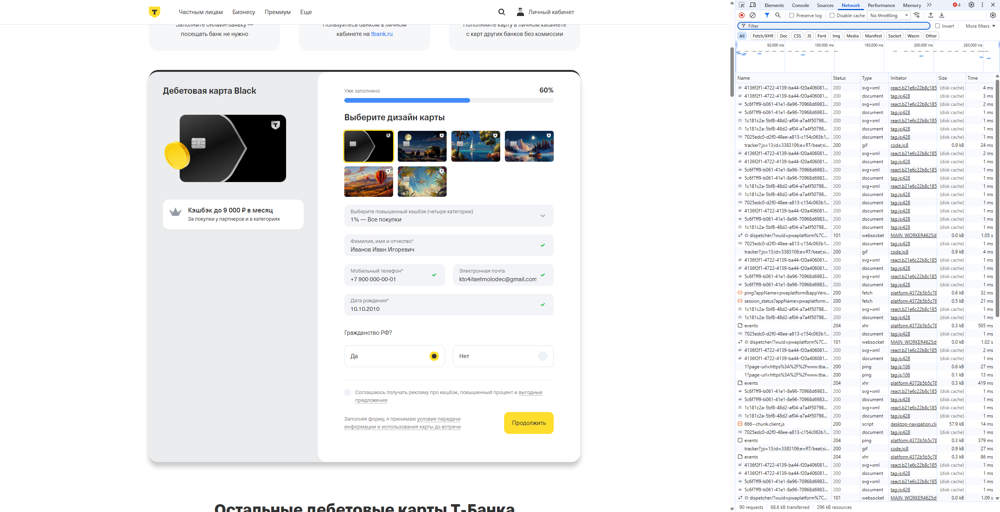
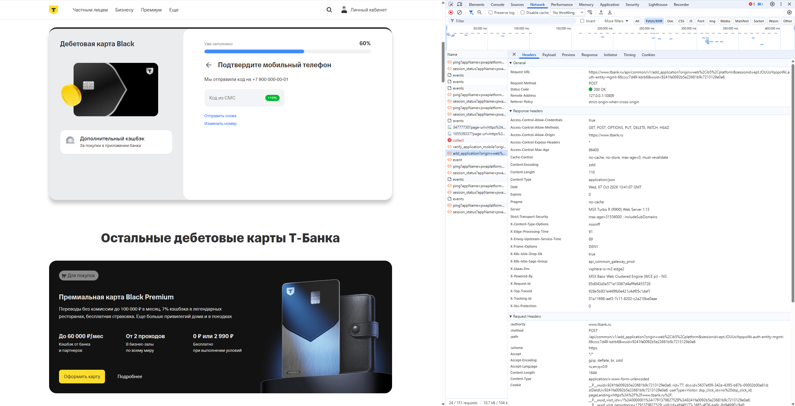
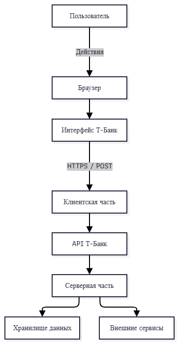

# Отчет по Лабораторной работе №1
**Тема:** Анализ цифрового сервиса T-Bank (Вариант 9)  
**Выполнил:** Котельников Данила ИТД-21

---

## 1. Описание выбранного сервиса
Для проведения анализа был выбран веб-сервис **Т-Банк** (tbank.ru).  
**Выбранный сценарий:** Просмотр публичных продуктов (каталог дебетовых карт) и заполнение формы заявки на получение дебетовой карты T-Black.

---

## 2. Пользовательский интерфейс и сценарий использования

1. **Главная страница и выбор продукта:** Пользователь переходит на сайт и выбирает раздел «Дебетовые карты», где знакомится с условиями карты T-Black.
2. **Заполнение формы:** Пользователь нажимает кнопку «Оформить карту» и заполняет персональные данные (ФИО, телефон, дата рождения).
3. **Подтверждение:** После отправки формы система переводит пользователя на шаг подтверждения номера телефона по SMS.

---

## 3. Галерея скриншотов

### 3.1. Главная страница сервиса

### 3.2. Выбор дебетовой карты

### 3.3. Заполненная форма заявки

---

## 4. Анализ клиентской части (DevTools)

В ходе заполнения формы заявки был исследован элемент ввода мобильного телефона с помощью вкладки **Elements** в DevTools.

* **Тег элемента:** `<input>`
* **Атрибуты:** `type="tel"`, `name="phone_mobile"`, `required=""`
* **Назначение:** Поле ввода номера телефона с автоматическим форматированием маски и валидацией данных на стороне клиента.

---

## 5. Анализ сетевого взаимодействия (Network)

При клике на кнопку «Продолжить» браузер отправляет сетевой запрос на сервер банка для создания заявки.

**Параметры запроса:**
* **Request URL:** `https://www.tbank.ru/api/common/v1/add_application`
* **Request Method:** `POST`
* **Status Code:** `200 OK`
* **Content-Type:** `application/json`

---

## 6. Архитектура системы

## 6. Архитектура системы

### 6.1. Основные компоненты
1. Пользователь
2. Браузер
3. Интерфейс Т-Банк
4. Клиентская часть
5. API Т-Банк
6. Серверная часть
7. Хранилище данных
8. Внешние сервисы

### 6.2. Связи между компонентами
Пользователь
↓
Браузер
↓
Интерфейс Т-Банк
↓
Клиентская часть
↓
API Т-Банк
↓
Серверная часть
↓
Хранилище данных
↓
Серверная часть
↓
Внешние сервисы
### 6.3. Подписи к стрелкам
* Пользователь → Браузер: **действия пользователя**
* Браузер → Интерфейс: **загрузка и отображение страницы**
* Интерфейс → Клиентская часть: **обработка действий пользователя**
* Клиентская часть → API: **HTTPS / POST-запрос**
* API → Серверная часть: **обработка запроса**
* Серверная часть → Хранилище данных: **чтение и запись данных**
* Серверная часть → Внешние сервисы: **обмен данными**
* API → Клиентская часть: **JSON-ответ**
* Клиентская часть → Интерфейс: **отображение результатов**

*Исходный файл схемы хранится в `diagrams/system_architecture.drawio`.*

---

## 7. Вывод

В ходе лабораторной работы была рассмотрена информационная система Т-Банк на примере сценария оформления заявки на дебетовую карту T-Black.

Были проанализированы основные элементы пользовательского интерфейса и HTML-структура одного из элементов формы (поле ввода телефона). С помощью DevTools было исследовано сетевое взаимодействие браузера с API сервиса. Был обнаружен POST-запрос к API `add_application`, после выполнения которого сервер возвращает данные в формате JSON со статусом 200 OK.

Также была рассмотрена связь между пользовательским интерфейсом, клиентской частью, API, серверной частью, хранилищами данных и внешними сервисами. На основе проведенного анализа была сформирована общая архитектурная модель информационной системы.
